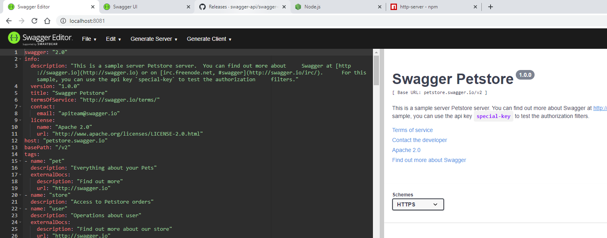
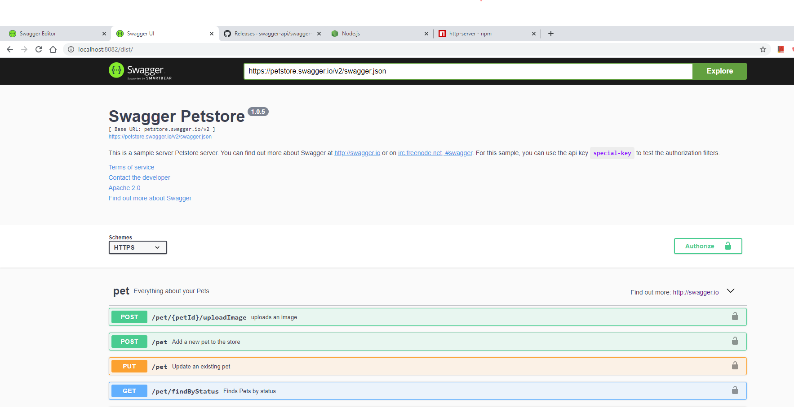

# Building APIs with Swagger and the OpenAPI Specification
## Prerequisites
- [swagger-editor](https://github.com/swagger-api/swagger-editor/releases)
- [swagger-ui](https://github.com/swagger-api/swagger-ui/releases)
- [Node.js](https://nodejs.org/en/)
- [http-server](https://www.npmjs.com/package/http-server)


## Steps
1. Download latest release of [swagger-editor](https://github.com/swagger-api/swagger-editor/releases) and unzip to a directory.
2. Download latest release of [swagger-ui](https://github.com/swagger-api/swagger-ui/releases) and unzip to a directory along `swagger-editor`.
3. Download and install [Node.js](https://nodejs.org/en/)
4. Run the following command to install [http-server](https://www.npmjs.com/package/http-server)
```bash
npm install -g http-server
```
5. Change into the unzipped directories of `swagger-editor` and `swagger-ui` and run the following:  
```bash
npm install
```
6. Change into the parent directory of `swagger-editor` and `swagger-ui`.
- Start a http server for `swagger-editor`:
```bash
http-server swagger-editor -a 127.0.0.1 -p 8080
```
- Start a http server for `swagger-ui`:
```bash
http-server swagger-ui -a 127.0.0.1 -p 8081
```
7. In your browser, navigate to `127.0.0.1:8080` for `swagger-editor` and `127.0.0.1:8081/dist/` for `swagger-ui`. If everything goes well, you should see something like below:  
  
   

